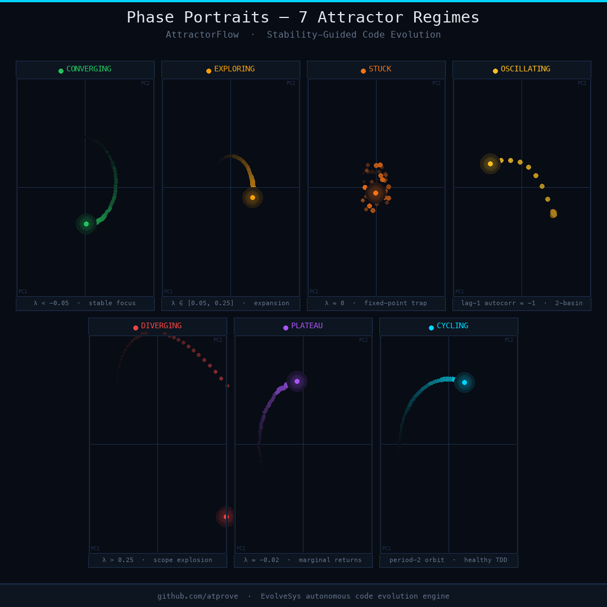

# attractor-flow-plugin-bench

A benchmark of the [**attractor-flow**](https://github.com/SharathSPhD/attractor-flow) Claude Code plugin — a stability-guided autonomous code evolution engine powered by dynamical systems theory (FTLE / Lyapunov exponents).

---

## What this repo measures

This benchmark runs **EvolveSys**, an autonomous improvement engine, on a deliberately weakened Python pipeline (`target_pipeline/`) across four quality axes:

| Axis | Baseline | Final (AF) | Target |
|------|----------|------------|--------|
| Test coverage | 41.2% | **90.4%** ✅ | 65% |
| Mypy strict errors | 51 | **17** ✅ | 47 |
| Benchmark time | 16.08 ms | 14.49 ms | 14.45 ms |
| Cyclomatic complexity (avg) | 3.07 | 2.87 | 2.07 |

The plugin drives all decisions: it detects when the agent is CONVERGING vs EXPLORING, fires bifurcation events (PITCHFORK, HOPF, SADDLE_NODE), and injects perturbations when the agent goes STUCK or OSCILLATING.

---

## Plugin

> **attractor-flow** — [github.com/SharathSPhD/attractor-flow](https://github.com/SharathSPhD/attractor-flow)

AttractorFlow exposes 8 MCP tools to any Claude Code agent:

| Tool | Purpose |
|------|---------|
| `attractorflow_record_state` | Record agent embedding after every step |
| `attractorflow_get_regime` | Classify trajectory as CONVERGING / EXPLORING / STUCK … |
| `attractorflow_get_lyapunov` | Compute FTLE (λ) — positive = diverging, negative = stable |
| `attractorflow_get_trajectory` | Return full PCA-projected path |
| `attractorflow_get_basin_depth` | Stability margin before committing a change |
| `attractorflow_detect_bifurcation` | Detect PITCHFORK / HOPF / SADDLE_NODE transitions |
| `attractorflow_inject_perturbation` | Escape STUCK / OSCILLATING loops |
| `attractorflow_checkpoint` | Save a stable checkpoint when tests pass |

---

## Phase portraits — all 7 regimes

The animated GIF below shows the 2D PCA projection of the agent's embedding trajectory under each regime. Pre-generated from this benchmark run.



| Regime | λ signature | Shape |
|--------|------------|-------|
| CONVERGING | λ < −0.05 | Inward spiral → stable focus |
| EXPLORING | λ ∈ [0.05, 0.25] | Outward expanding arc |
| STUCK | λ ≈ 0 | Jitter cloud, fixed-point trap |
| OSCILLATING | lag-1 autocorr ≈ −1 | Two-basin pendulum |
| DIVERGING | λ > 0.25 | Exponential escape |
| PLATEAU | λ ≈ −0.02 | Near-flat drift, marginal returns |
| CYCLING | period-2 orbit | Clean ellipse, healthy TDD |

---

## Interactive benchmark report

Open [`evolve_sys/benchmark_report.html`](evolve_sys/benchmark_report.html) directly in any browser — no server needed. All run data is inlined as JavaScript variables at build time (works on `file://` and GitHub Pages).

To rebuild the report from updated run logs:
```bash
python scripts/build_report.py
```

To regenerate the phase portrait GIF:
```bash
python scripts/make_regime_gif.py
```

---

## Repo layout

```
target_pipeline/          # Code being evolved (4 intentional weaknesses)
target_pipeline_original/ # Unmodified baseline (pre-EvolveSys)
evolve_sys_baseline/      # Greedy (non-attractor) run for comparison
evolve_sys/               # EvolveSys orchestration + AF run data + report
scripts/                  # build_report.py, make_regime_gif.py
```

---

## Setup

```bash
python3.12 -m venv .venv
.venv/bin/pip install -r requirements.txt

# Measure current quality
python -m evolve_sys.quality_metrics

# Run one improvement cycle (requires attractor-flow plugin active in Claude Code)
# Use /evolve-cycle inside Claude Code
```

---

## Author

[SharathSPhD](https://github.com/SharathSPhD)

## License

[MIT](LICENSE)
